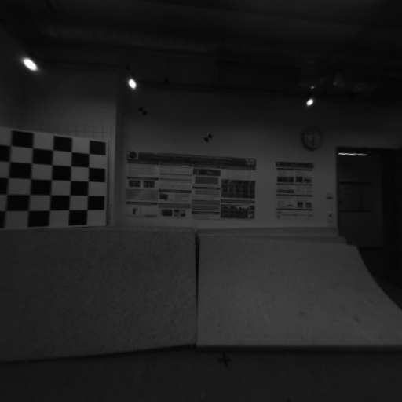

# Fisheye camera distortion calibration

Image undistortion example with OpenCV Python for **TUM Visual-Inertial Dataset**

## Camera geometric model
(Reference: https://github.com/ethz-asl/kalibr/wiki/supported-models)

Two key parameters is been used for geometric calibration:
1. 
omnidirectional camera model (omni) 
(intrinsics vector: [xi fu fv pu pv])
The intrinsics vector contains all parameters for the model:
  * fu, fv: focal-length
  * pu, pv: principal point
  * xi: mirror parameter (only omni)
```
K = 
fu 0  pu
0  fv pv
0  0  1
```

equidistant (equi)
(distortion_coeffs: [k1 k2 k3 k4])

## Before calibration


## After calibration

